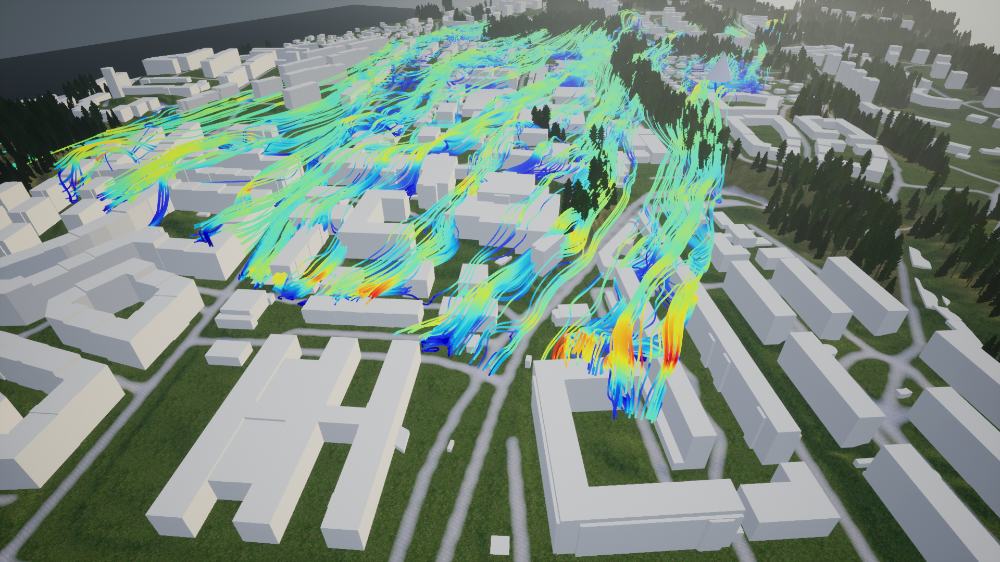

# Introduction

DTCC Visualization Plugin is an Unreal Engine visualization plugin for importing and visualizing scientific data in Unreal Engine.

Users can import streamline and volumetric data into Unreal Engine. The plugin handles the translation of data to
Unreal Engine native types which can be used in its visualization systems. Currently, the plugin contains three different
visualization systems depending on the type of data that need to be visualized.

The the streamline data can be visualized using either a Niagara Particle System or Procedural Mesh geometry while the
volumetric data visualization is handled via a Niagara Particle System.

Streamlines.

Volumetric data.
